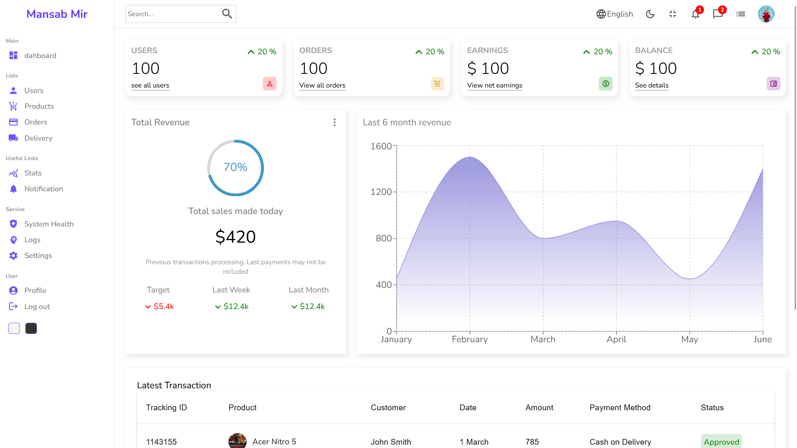
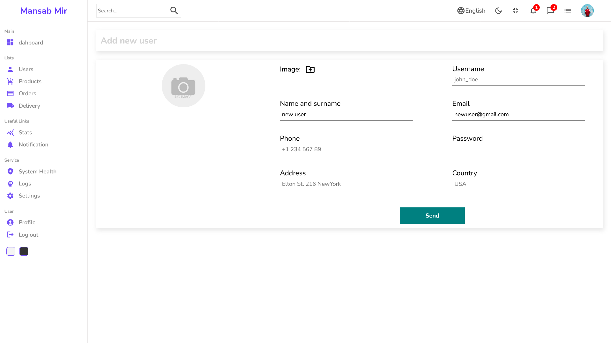
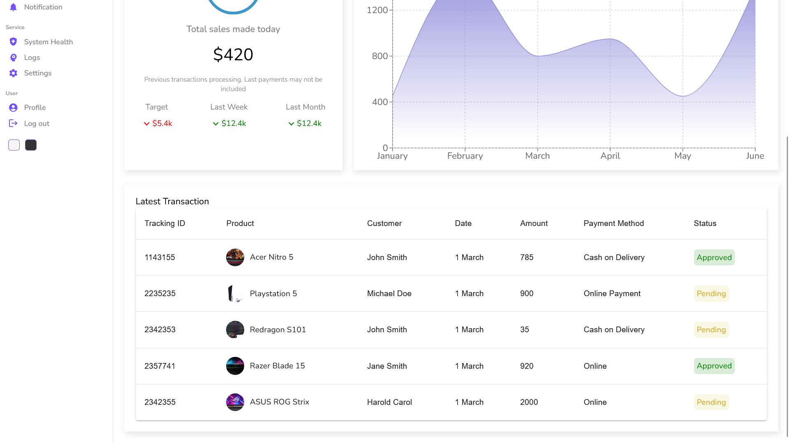

# Admin Dashboard
## an admin dashboard project made using react.js

An admin dashboard with features of React tables, React chart, routes , view and add new users.

Project snaps

Live demo video of project:

<video src="public/assets/dashboard.mp4" controls title="Title"></video>

## Features

- React charts for easy data visualisation
- React table to keep records of pending and approved products
- React datagrid with pagination and and checkbox features
- Adding  and removing users direct from dashboard
- Checking status of each user through dashboard

Clone the project and run the command to install it

Created by Mansab Mir

